# Quick start
1. git clone git@github.com:fastRedwood/ETHShanghai2022.git
2. Copy  a .env file  `>cp -a env.example  .env` and fill with your own parameters.
3. Get an NFT.Storage API key https://nft.storage/ and add this to the .env
4. Add your rinkeby blockchain server api and url to the .env file (ive used alchemy here, though moralis & infura are also awesome)
5. Install packages `>npm install`
6. Deploy the solidity contract to the rinkeby testnet using hardhat `>npx hardhat run scripts/deploy.js --network rinkeby`
7. Add your contract address to the .env file
8. Run your front end in dev mode `>npm start` OR deploy with Fleek https://fleek.co/

## DApp Step Show

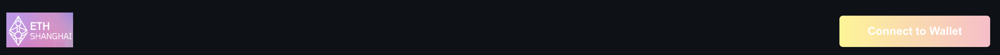
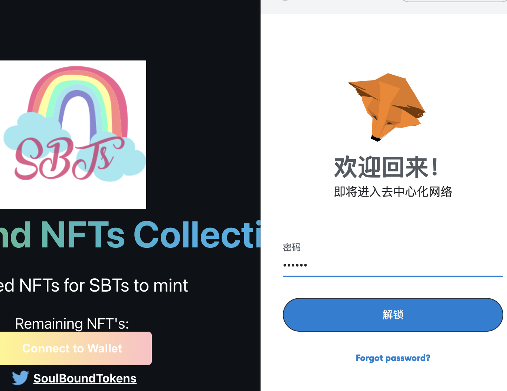
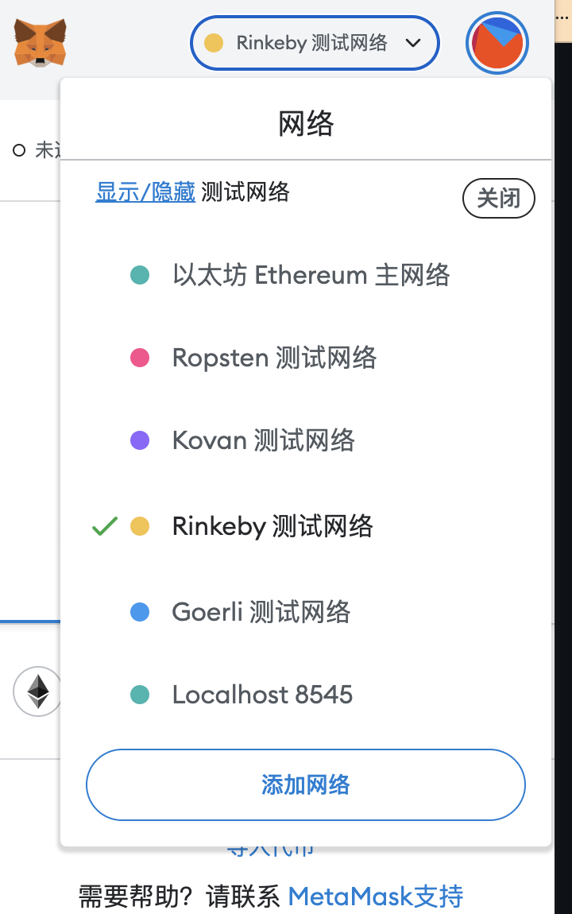
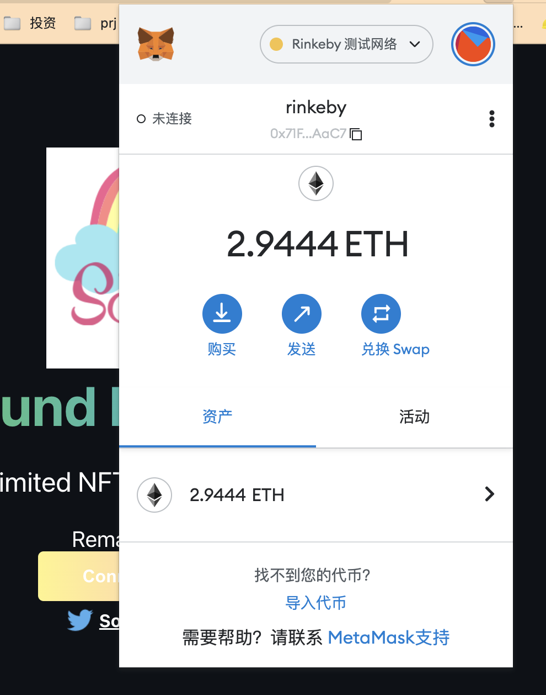
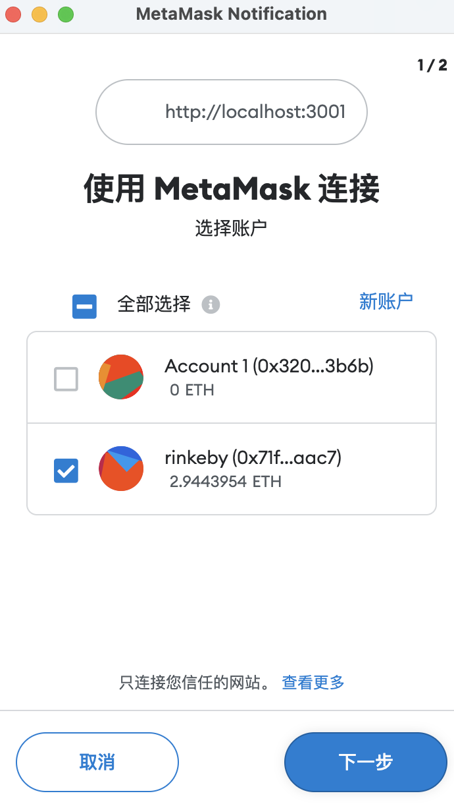
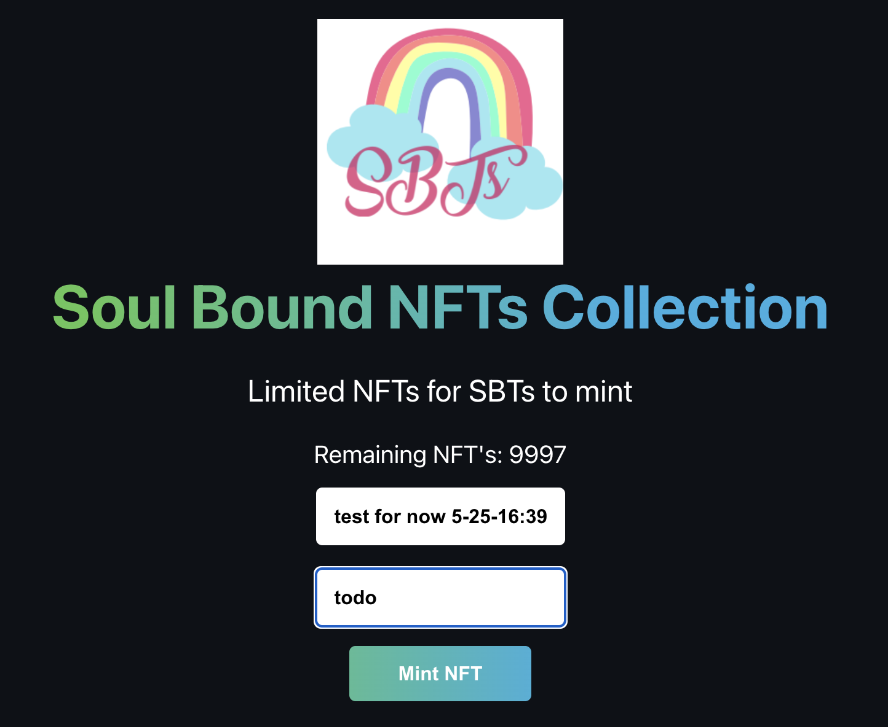
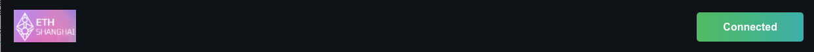
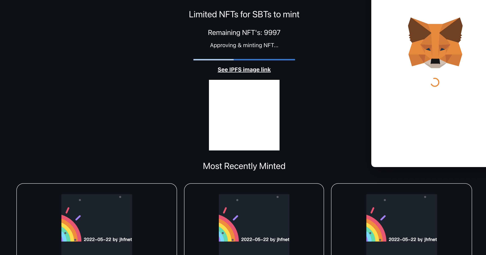

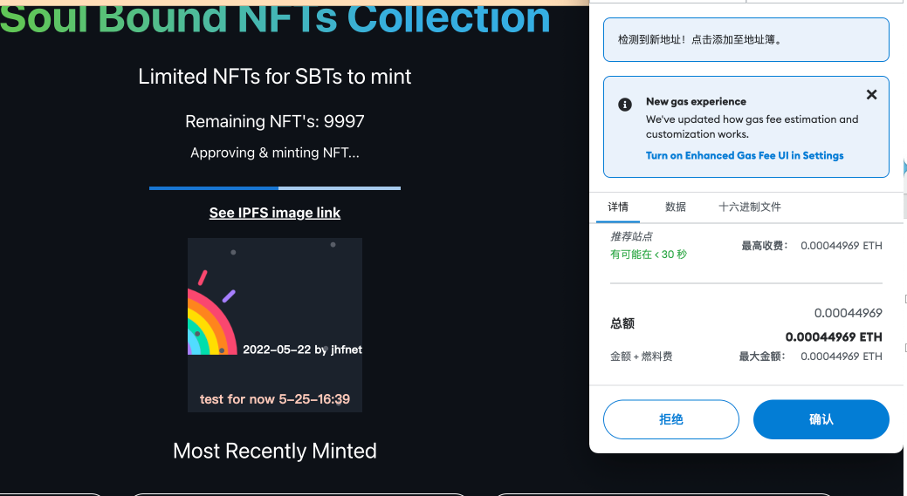
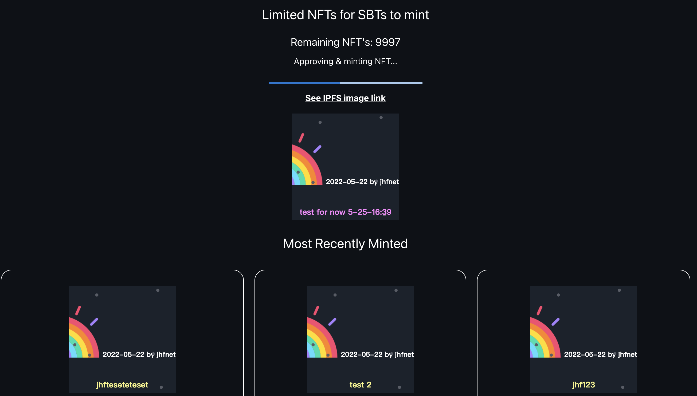
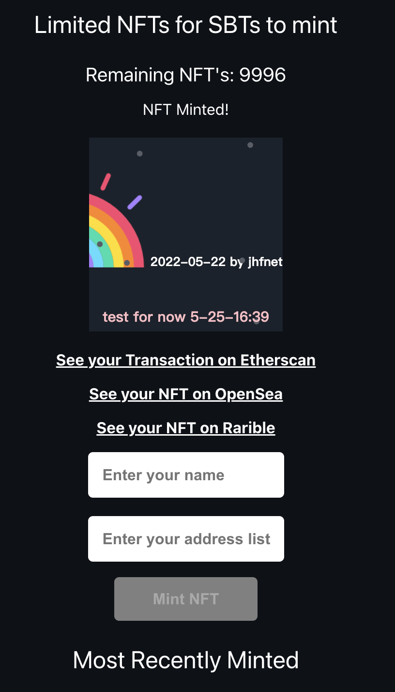
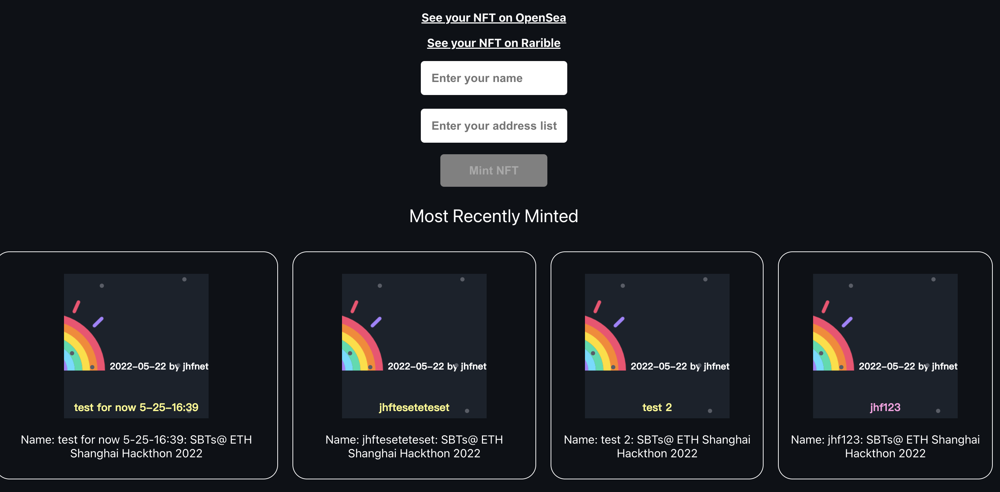

## Setup from scratch instead:

> npx create-react-app my-app-name
> cd my-app-name
> npm install --save-dev hardhat
> npx hardhat (to get a sample project - choose basic project so we get all the folders. Choose no to gitignore and y to dependencies)

install dependencies:

> npm install --save-dev @nomiclabs/hardhat-waffle ethereum-waffle chai @nomiclabs/hardhat-ethers @nomiclabs/hardhat-etherscan @openzeppelin/contracts
> npm install ethers dotenv

Tasks - development of contract

> add .env to the .gitignore file
> rm ./contracts/Greeter.sol
> rm ./scripts/sample-script.js

> touch ./contracts/SoulToken.sol
> touch ./scripts/run.js
> touch ./scripts/deploy.js

Write solidity contract
Write run.js and test your contract

> npx hardhat run scripts/run.js

Sign up for etherscan / get an API key & add it to hardhat.config
networks: {
rinkeby: {
url: process.env.MORALIS_RINKEBY_API_URL,
accounts: [process.env.METAMASK_RINKEBY_PRIVATE_KEY],
},
},
etherscan: {
// Your API key for Etherscan
// Obtain one at https://etherscan.io/
apiKey: process.env.ETHERSCAN_API_KEY,
}
### Resources

- Read the IPFS best practice guide for NFT's https://docs.ipfs.io/how-to/mint-nfts-with-ipfs/#a-short-introduction-to-nfts
- See the NFT.School guide https://nftschool.dev/
- Public Gateway status checker: https://ipfs.github.io/public-gateway-checker/
- Faucets for rinkeby eth: https://faucets.chain.link/rinkeby
